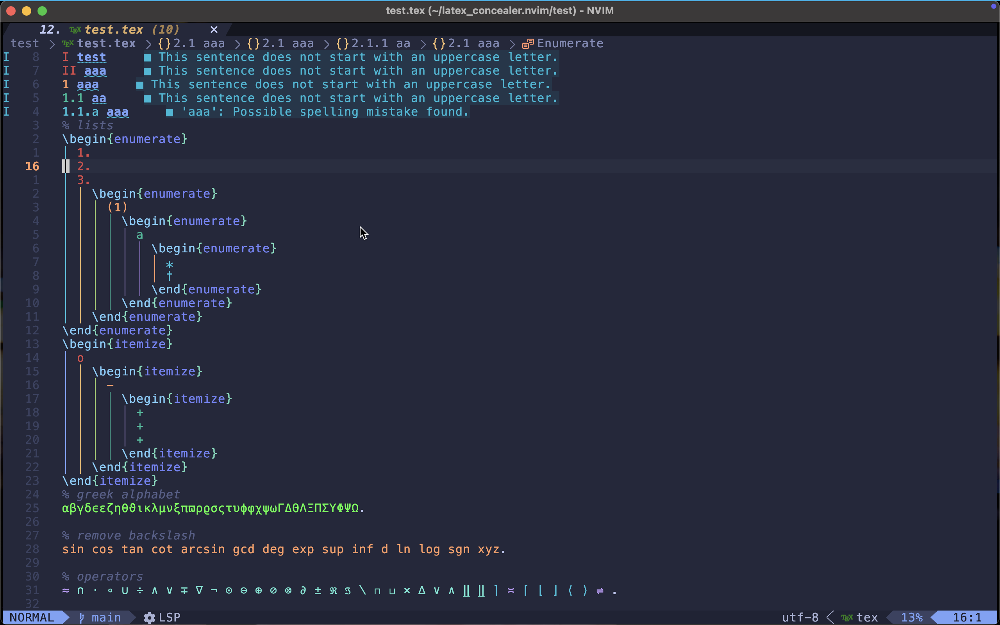

> **Warning:** This plugin is still alpha, expect break changes and bugs! 
# latex_concealer.nvim
More powerful conceal for latex code with neovim. 


# features
1. write with pure lua, and very fast. 
1. colorful conceal and multichar conceal since we use extmark. 
1. dynemic conceal, such as concealing `\item` into the value of counter or use rainbow color for delim. 
1. customizable. You can add your own conceal very easy. 
1. more flexible and exact since we use tree-sitter instead of string match. 
1. supporting optional arg and args without curly bracket because I wrote a parse to do it. 

# dependencies
`nvim-treesitter` and parser for latex

# install 
For example by `lazy.nvim`:
```lua 
{
  "dirichy/latex_concealer.nvim",
    ft={"tex","latex"},
    opts={},
    config=true,
}
```

# config
You can pass your own options to `opts`, here is an example. You can see default value in init.lua:
```lua
M.config = {
    ---To handle matched treesitter node
	processor_map = {
        ---The key is treesitter node type, value is how to treat this node. 
		generic_command = require("latex_concealer.processor.generic_command"),
        ---For begin, value is function(buffer,node) to do some counter-related things. 
		begin = {
			enumerate = function(buffer, node)
				counter.item_depth_change(buffer, true, 1)
			end,
			itemize = function(buffer, node)
				counter.item_depth_change(buffer, false, 1)
			end,
		},
        ---For end, value is function(buffer,node) to do some counter-related things. 
		["end"] = {
			enumerate = function(buffer, node)
				counter.item_depth_change(buffer, true, -1)
			end,
			itemize = function(buffer, node)
				counter.item_depth_change(buffer, false, -1)
			end,
		},
	},
    ---To set concealcursor
	conceal_cursor = "nvic",
    ---Events to refresh
	refresh_events = { "InsertLeave", "BufWritePost" },
	local_refresh_events = { "TextChangedI", "TextChanged" },
	cursor_refresh_events = { "CursorMovedI", "CursorMoved" },
    ---Something about counters
    counter={
        ---Same as `\the` command in latex, but is turple of string. The second is hl_group to use. 
        the = {
            chapter = { "\\zhnum{chapter}、", "ErrorMsg" },
            section = { "\\Roman{chapter}.\\roman{section} ", "Constant" },
            subsection = { "\\arabic{chapter}.\\arabic{section}.\\arabic{subsection} ", "DiagnosticHint" },
            subsubsection = {
                "\\arabic{chapter}.\\arabic{section}.\\arabic{subsection}\\alph{subsubsection} ",
                "Special",
            },
            enumi = { "\\zhdig{section}.\\Roman{enumi}.", "ErrorMsg" },
            enumii = { "\\Roman{enumi}.\\Alph{enumii}", "Constant" },
            enumiii = { "\\Roman{enumi}.\\Alph{enumii}(\\zhdig{enumiii})", "DiagnosticHint" },
            enumiv = { "\\fnsymbol{enumiv}", "Special" },
        },
        ---For unordered list(itemize) conceal.
        unordered = {
            { "o", "ErrorMsg" },
            { "-", "Constant" },
            { "+", "DiagnosticHint" },
            { "=", "Special" },
            { "DON'T NEST LIST MORE THAN FOUR LAYER", "ErrorMsg" },
        },
    }
    -- You can set highlight group for every element here
    extmark={highlight={relationship="Special",greek="Hint"}}
}
```
